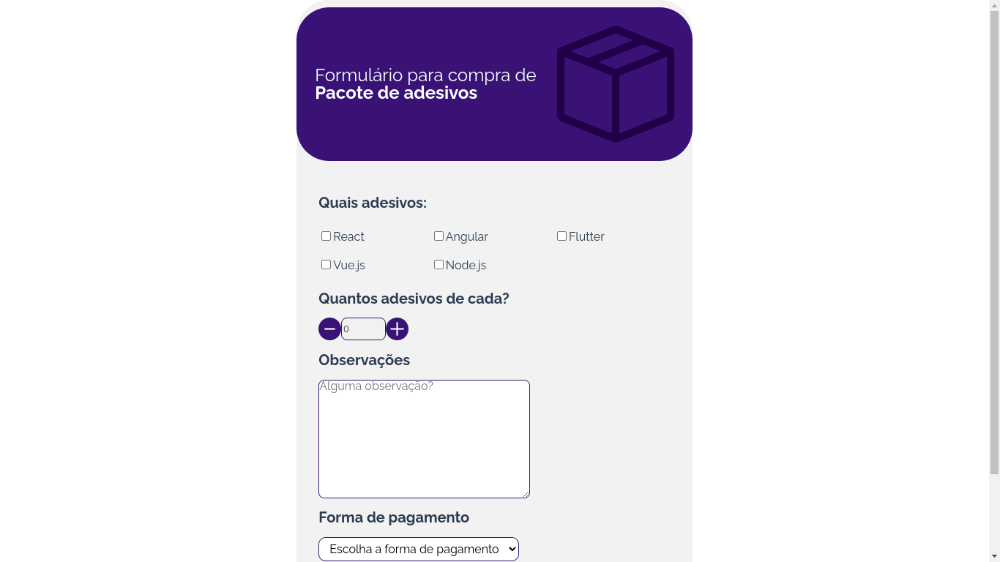

# Desafio Bem Paggo

<p>
  Desafio formulário Bem Paggo.
</p>

## Instação

<br>

### Clone o repositório

```
git clone
```

### Acesse o diretorio

```
cd <nome-da-pasta>
```

### Instale as dependências

```
npm install
```

### Inicie a aplicação

```
npm run start
```

### A aplicação, por padrão, fica na porta:

```
http://localhost:3000/
```

### Testes da aplicação

```
npm run test
```

## Imagem do projeto



## Tecnologias utilizadas

<ul>
    <li>Vue</li>
    <li>JavaScript</li>
    <li>Vite</li>
    <li>Vitest</li>
</ul>

## Feito por:

### João Victor dos Santos Moura

### E-mail: joaovictors.mouraa@gmail.com

### Linkedin: https://www.linkedin.com/in/jovimoura10/
